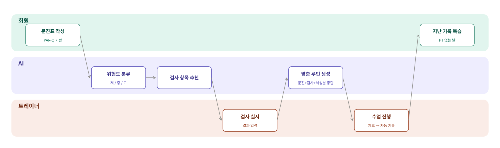

# 🏋️ Movement.log

**PT 수업을 기억하는 가장 안전한 방법** — 회원의 몸 상태에 맞춘 운동을, PT가 없는 날에도 안전하게 복습할 수 있게 돕는 서비스입니다.

🔗 [서비스 링크](https://movement-log-three.vercel.app) · 🏆 원티드 AI Championship 2026 출품작

> 로그인 화면에 트레이너/회원 테스트 계정이 안내되어 있어 바로 체험 가능합니다.


---

## 왜 만들었나

PT 트레이너로 일하며 가장 많이 들었던 말은 "오늘 뭐 했는지 기억이 안 나요"였습니다. 수업이 끝나면 회원은 배운 운동을 금방 잊고, 혼자 해보려 해도 "이 운동을 내 몸 상태로 계속해도 되는지" 확신이 없어 실행에 옮기지 못합니다. 특히 부상·수술·지병 이력이 있는 회원일수록 이 불안감이 커서 자율 운동 지속률이 떨어지고, 이는 PT 재등록률 저하로도 이어집니다.

**Movement.log**는 트레이너가 체크만 하면 수업 내용이 자동으로 기록되고, 회원은 그 기록을 PT 없는 날 앱에서 그대로 복습할 수 있게 합니다. 여기에 AI가 회원의 문진·검사·체성분 데이터를 근거로 "왜 이 루틴이 이 사람에게 안전한지"까지 설명해주는 것이 핵심 차별점입니다.

## AI를 어떻게 썼나 — 단발성 응답이 아닌 3단계 추론 파이프라인

역할별로 묶어서 보면, 회원은 처음(문진)과 끝(복습)만 관여하고 그 사이 판단은 AI가, 실행은 트레이너가 맡습니다.



| 단계 | 입력 | AI가 하는 일 |
|---|---|---|
| 위험도 분류 | PAR-Q 7문항 응답, 나이 | 저/중/고 3단계로 분류. 이후 건강 상태가 업데이트될 때마다 재판단 |
| 검사 항목 추천 | 문진 내용(부상/통증 이력) | 트레이너가 진행할 검사 2~3개를 골라 제안 |
| 루틴 생성 | 문진 + 검사 결과 + 인바디 체성분 | 회원별 맞춤 운동과 **운동별 개인화된 주의사항**을 생성. 골격근량이 낮으면 저강도부터, 위험도가 낮지 않으면 무게 운동·고강도 동작을 후보에서 자동 제외 |
| 인바디 자동인식 | 인바디 결과지 사진 | Vision으로 체중·체지방량·골격근량 등 수치를 자동 추출 (트레이너 확인 후 저장) |

**설계 원칙**: AI는 항상 "제안"만 하고 최종 결정은 트레이너가 합니다. 사진에서 못 읽은 값은 지어내지 않고 `null`로 남기며, 위험도는 악화 방향으로만 재분류됩니다(안전 우선).

## 스크린샷

**회원목록** — 위험도·가입상태 한눈에 보이는 대시보드


**인바디 사진 자동인식** — 사진을 올리면 AI가 수치를 자동으로 읽어옵니다


**지난 수업 기록 복습** — 회원이 PT 없는 날 확인하는 화면


**인바디 추이 그래프** — 체성분 변화를 한눈에


## 기술 스택

| 영역 | 선택 | 이유 |
|---|---|---|
| 프레임워크 | Next.js 16 (App Router, TypeScript) | 프론트·백엔드를 한 프로젝트로 관리 |
| DB / 인증 | Supabase (Postgres + Auth) | RLS로 트레이너/회원 데이터 접근 분리 |
| AI | Claude API (`claude-sonnet-5`, `claude-haiku-4-5`) | 구조화된 추론이 필요한 단계는 Sonnet, 비전+비용 최적화가 필요한 인바디 인식은 Haiku |
| 스타일 | Tailwind CSS, shadcn/ui | |
| 배포 | Vercel (서울 리전) | |
| 개발 도구 | Claude Code | 3주 개인 개발 기간 내 전체 서비스 구현 |

## 기술적으로 까다로웠던 것들

- **AI가 실재하지 않는 운동을 만들지 못하게 하기**: 루틴 생성 시 AI가 자유 텍스트로 운동을 만드는 대신, DB의 운동 라이브러리(78개) 안에서만 `enum` 기반으로 선택하도록 제한하고, 응답 후에도 서버에서 한 번 더 필터링하는 이중 방어 구조를 적용했습니다.
- **과거 기록이 조용히 바뀌는 데이터 정합성 버그**: 초기에는 수업 기록이 루틴 항목을 참조만 하는 구조였는데, 트레이너가 나중에 운동을 수정하면 과거 완료 기록까지 값이 바뀌어 보이는 문제를 발견했습니다. "수업 완료" 시점의 값을 스냅샷으로 저장하고, 매번 새 루틴을 생성하는 구조로 재설계해 해결했습니다.
- **모바일에서만 발생한 레이아웃 여백 버그**: 특정 화면만 폰에서 좌우 여백이 있어 보였는데, 원인은 `<body>`가 `flex flex-col`일 때 자식 페이지의 `mx-auto`가 stretch를 무시하고 "줄바꿈 없는 가장 넓은 한 줄" 폭으로 쪼그라드는(shrink-to-fit) CSS 동작이었습니다. viewport 메타태그나 iOS 자동확대 같은 그럴듯한 가설들을 하나씩 배제해가며 근본 원인을 찾았습니다.
- **인바디 사진 인식 실패**: "모델의 해상도 제한 때문일 것"이라는 가설로 모델을 교체했지만 재발했고, 실제 원인은 Vercel 서버리스 함수의 고정 4.5MB 요청 크기 제한(HEIC→JPEG 변환 후 용량 증가 + base64 인코딩)이었습니다. 업로드 전 클라이언트 리사이즈로 해결했습니다.

## 로컬 실행

```bash
git clone https://github.com/iigniim/movement-log.git
cd movement-log
npm install
cp .env.example .env.local  # Supabase/Anthropic 키 입력
npm run dev
```

## 출처

- 운동 라이브러리는 [free-exercise-db](https://github.com/yuhonas/free-exercise-db) (Public Domain)를 기반으로 필터링·한글화했습니다.
